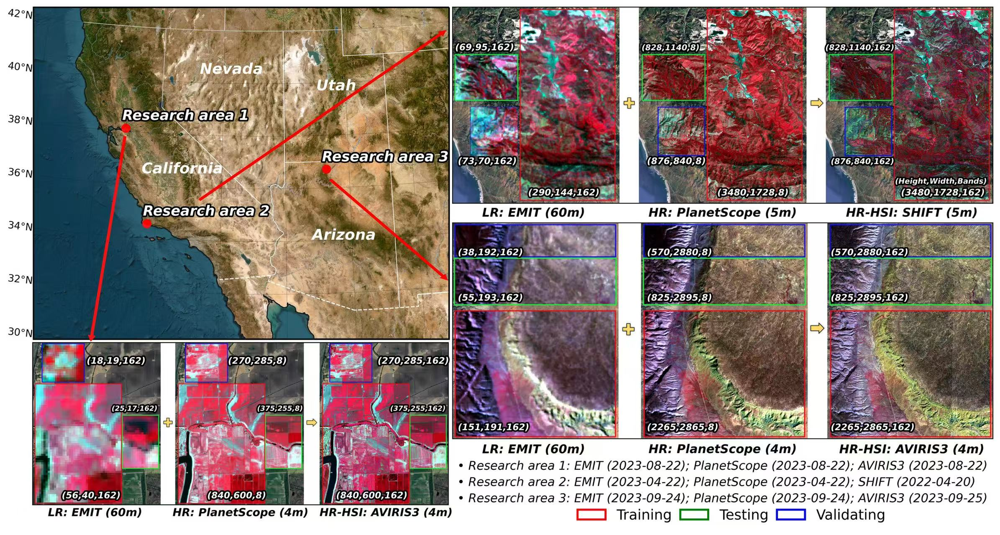
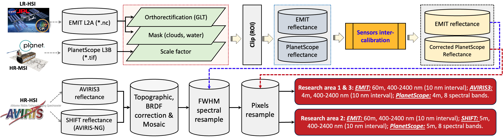
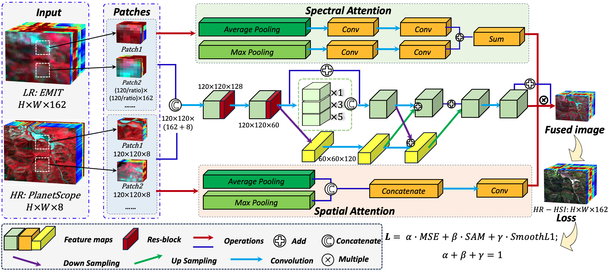

# Robust hyperspectral reconstruction from satellite and airborne observations via a deep hierarchical fusion network across heterogeneous scenarios

Fujiang Ji <sup>a</sup>, Jiaqi Yang <sup>a</sup>, Philip A. Townsend <sup>a</sup>, Ting Zheng <sup>a</sup>, Kyle R. Kovach <sup>a</sup>, Tong Yu <sup>b</sup>, Ruqi Yang <sup>a</sup>, Ming Liu <sup>c</sup>, Min Chen <sup>a, *</sup>  


<sup>a</sup> Department of Forest and Wildlife Ecology, University of Wisconsin-Madison, Madison, WI, 53706, USA  
<sup>b</sup> Department of Biological Systems Engineering, University of Wisconsin-Madison, Madison, WI, 53706, USA  
<sup>c</sup> Department of Computer Sciences, University of Wisconsin-Madison, Madison, WI, 53706, USA

## Summary
* High-resolution hyperspectral imagery (HR-HSI) is essential for fine-scale ecological and environmental monitoring, yet current spaceborne sensors are constrained by a trade-off between spectral and spatial resolution. Spectral reconstruction through data fusion has emerged as a promising solution for efficiently generating HR-HSI imagery.
* The practical utility of existing methods remains limited, as most have been trained on synthetic, perfectly aligned datasets that overlook real-world sensor discrepancies and frequently emphasize spatial fidelity, often neglect full-spectrum spectral fidelity, leaving open questions about the real-world generalization of these models. 
* In this study, we proposed a reproducible and generalizable deep learning framework that fuses LR-HSI from NASA’s EMIT sensor with HR-MSI from PlanetScope to reconstruct HR-HSI across three ecologically distinct U.S. landscapes. The results demonstrated that our proposed deep learning architectures, integrating the multi-scale feature extraction and spatial-spectral signal enhancement modules, consistently outperformed seven state-of-the-art baselines,indicating superior spectral fidelity, spatial accuracy, and reconstruction robustness. 
* This study demonstrates that compact, well-designed models can offer scalable, high-fidelity HR-HSI reconstruction, enabling broad applications such as biodiversity assessment and environmental change detection.

* **Objectives:**
  * **_(1) How do existing fusion methods and our proposed architecture perform and generalize when applied to real, cross-platform remote sensing data?_**
  * **_(2) How does model complexity affect the accuracy and effectiveness of hyperspectral reconstruction?_** 
* **Conclusions:**
  * By leveraging the real-world, cross-sensor remote sensing data from spaceborne and airborne platforms, the proposed approaches address key limitations of prior methods. The integration of multi-scale feature extraction and spatial-spectral signal enhancement modules in our proposed architectures enables the models to preserve fine spatial details while maintaining high spectral fidelity across the full reflectance spectrum. 
  * Through comprehensive comparisons across three ecologically distinct study areas in the western U.S, we demonstrated that our proposed MSHFNet and MSAHFNet outperform seven state-of-the-art baselines in both spectral and spatial accuracy, confirming the best robustness, generalizability in hyperspectral reconstruction using authentic, cross-platform observations.
  * Our findings reveal that greater model parameter size and architectural complexity do not inherently improved hyperspectral reconstruction accuracy. Instead, thoughtful architectural design, centered on efficiency and task-specific feature learning, proves more effective than brute-force increases in model complexity. 
* our study highlights the potential of deep learning-based fusion frameworks to generate high-resolution hyperspectral data at scale. Such capabilities are critical for enabling continuous, high-fidelity monitoring of ecosystem dynamics, with broad applications in environmental science, agriculture, and land resource management.

## Three ecologically distinct research areas
<div align="center">
  
  <p><b>Fig. 1.</b> Overview of the research areas in this study.</p>
</div>

## Multi-steps for hyperspectral reconstruction
### Requirements
* Python 3.8.20 and more in [`environment.yml`](environment.yml)

### Usage

* **Clone this repository and set environment**

  ```
  git clone https://github.com/FujiangJi/SmallSat_hyperspectral_reconstruction.git
  conda env create -f environment.yml
  conda activate py38
  ```
### Step 1: Process the original EMIT, PlanetScope and AVIRIS3/SHIFT data.
* **EMIT L2A surface reflectance product:**  
  * **Background:** The [EMIT](https://earth.jpl.nasa.gov/emit/) Project delivers space-based measurements of surface mineralogy of the Earth’s arid dust source regions. These measurements are used to initialize the compositional makeup of dust sources in Earth System Models (ESMs). The dust cycle, which describe the generation, lofting, transport, and deposition of mineral dust, plays an important role in ESMs. Dust composition is presently the largest uncertainty factor in quantifying the magnitude of aerosol direct radiative forcing. By understanding the composition of mineral dust sources, EMIT aims to constrain the sign and magnitude of dust-related radiative forcing at regional and global scales. During its one-year mission on the International Space Station (ISS), EMIT will make measurements over the sunlit Earth’s dust source regions that fall within ±52° latitude. EMIT will schedule up to five visits (three on average) of each arid target region and only acquisitions not dominated by cloud cover will be downlinked. EMIT-based maps of the relative abundance of source minerals will advance the understanding of the current and future impacts of mineral dust in the Earth system. 
  * **Data Access:** EMIT Data Products are distributed by the [LP DAAC](https://lpdaac.usgs.gov/). Learn more about EMIT data products from [EMIT Product Pages](https://lpdaac.usgs.gov/product_search/?query=emit&status=Operational&view=cards&sort=title) and search for and download EMIT data products using [NASA EarthData Search](https://search.earthdata.nasa.gov/search?q=%22EMIT%22)
  * **Instructions for processing:** The [EMIT data product resources repository](https://github.com/FujiangJi/EMIT-Data-Resources.git) provide detailed tutorials for processing this kind of data.
  * Please refer to the [EMIT_data_processing.ipynb](original_data_processing/EMIT_data_processing.ipynb) in this repository for converting the raw EMIT data with NetCDF formate to GeoTiFF format using [emit_tools.py](original_data_processing/emit_tools.py).
* **PlanetScope L3B data:**  
  * **Background:** The PlanetScope L3B product provides orthorectified, near-nadir surface reflectance imagery at a spatial resolution of 3 m across eight spectral bands spanning the blue to near-infrared regions: coastal blue (431–452 nm), blue (465–515 nm), green I (513–549 nm), green (547–583 nm), yellow (600–620 nm), red (650–680 nm), red-edge (697–713 nm), and near-infrared (NIR; 845–885 nm) ([Planet team, 2023](https://assets.planet.com/docs/Planet_PSScene_Imagery_Product_Spec_letter_screen.pdf)). PlanetScope images are acquired by CubeSats from three satellite generations, each carrying distinct imaging instruments identified as PS2, PS2.SD, and PSB.SD. 
  * In this study, data collected by the **PSB.SD** instrument were used. This instrument orbit at altitudes ranging between 475 and 525 km, featuring a field of view of approximately 4.0° (swath) by 2.3° (scene length) and a frame size of approximately 32.5 km × 19.6 km. The PlanetScope L3B data covering daily observations from March 2020 to the present. Data access from [Planet Labs](https://www.planet.com/).
* **Airborne data: AVIRIS3 and SHIFT:**  
  * [**AVIRIS-3**](https://earth.jpl.nasa.gov/estd-missions/airborne/aviris-3/) operates across the VSWIR spectral region, covering wavelengths from 390 nm to 2500 nm with a spectral sampling interval of approximately 7.4 nm. In this study, AVIRIS-3 data were collected at a spatial resolution of approximately 3.5 m. 
  * [**SHIFT**](https://www.jpl.nasa.gov/images/pia25144-shift-campaign-research-plane-flight-area-map/) campaign serves as an airborne precursor to NASA’s forthcoming SBG mission, employing NASA's AVIRIS-Next Generation airborne VSWIR imaging spectrometer, which captures spectral data from 380 nm to 2510 nm at a spectral resolution of approximately 5 nm and a spatial resolution of 5 m.
  * Topographic and BRDF corrections were conducted based on [Hytools](https://github.com/EnSpec/hytools). Then Apply GLT and mosaic operation for Topographic and BRDF corrected AVIRIS and SHIFT imagery through [AVIRIS3_processing.ipynb](original_data_processing/AVIRIS3_processing.ipynb) and [SHIFT_processing.ipynb](original_data_processing/SHIFT_processing.ipynb).

### Step 2: Post-processing to pair the LR-HSI, HR-MSI and HR-HSI imagery.
<div align="center">
  
  <p><b>Fig. 2.</b> Summarized workflow for the data processing.</p>
</div>

* Utilizing the [pairing_EMIT_PlanetScope.ipynb](original_data_processing/pairing_EMIT_PlanetScope.ipynb) to generate geolocational paired EMIT and PlanetScope data, include:
  * (1) Reproject imagery to the same UTM projection; 
  * (2) Clip the imagery using the same ROI; 
  * (3) Apply the scale factor to convert PlanetScope reflectance to 0 ~ 1;
  * (4) Sensors inter-calibration.

### Step 3: Deep learning-based fuison algorithms implementation.
<div align="center">
  
  <p><b>Fig. 3.</b> Architecture of the data fusion framework.</p>
</div>

* **Running environment for this study:** a high-performance Linux-based computing system equipped with a dual-socket Intel Xeon Gold 6526Y processor (2 × 16-core CPUs at 3.90 GHz), 256 GB of RAM, two NVIDIA L40S GPUs (46 GB each), and one NVIDIA A100-SXM4 GPU (40 GB).
* **Instructions:** _Navigate to the directory [**`src_code`**](model_code) and execute the code in the following steps after updating the input/output paths:_
  ```
  python 0_main.py
  ```
* **Description:**  
  * In [0_main.py](model_code/0_main.py), we first run the function [**data_extraction**](model_code/data_extraction.py) extract the exactly matched LR-HSI, HR-MSI and HR-HSI imagery.
  * Second, running the function [**modeling_data_load**](model_code/modeling_data_load.py) to get the training, validating and testing data.
  * Finally, [**train**](model_code/train.py) and [**test**](model_code/test.py) the models.
  
## Datasets
* The processed paired LR-HSI, HR-MSI and HR-HSI can be found through **[Hugging Face 🤗](https://huggingface.co/datasets/FujiangJi/hyperspectral_reconstruction_datasets) _After accepted by a scientific journal_**.

## Reference
In case you use our framework and code in your research, Please cite our paper:
* If you have any questions, please feel free to reach me at fujiang.ji@wisc.edu.
  ```
  Ji, F.; Yang, J.; Townsend, P. A.; Zheng, T.; Kovach, K. R.; Yu, T.; Yang, R.; Liu, M.; Chen, M. 
  Robust hyperspectral reconstruction from satellite and airborne observations via a deep hierarchical 
  fusion network across heterogeneous scenarios. 2025. (Manuscript submitted, DOI forthcoming).
  ```

## Contact
```
fujiang.ji@wisc.edu
min.chen@wisc.edu
```
## Credits
* This study is supported by the National Aeronautics and Space Administration (NASA) through Commercial SmallSat Data Scientific Analysis (CSDSA), Remote Sensing Theory and Terrestrial Ecology programs.
* We acknowledge high-performance computing support from the Department of Computer Sciences at UW-Madison. 
